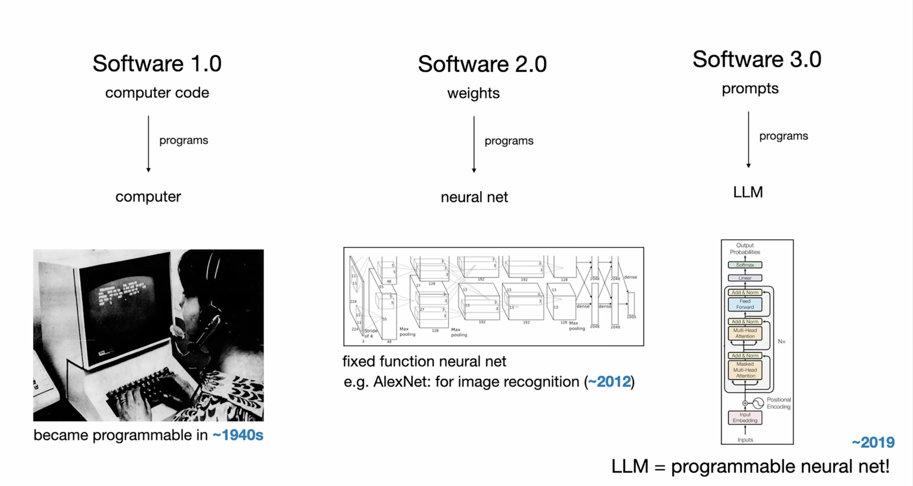

In June of 2025, Andrej Karpathy gave a talk at YC's AI Startup School
titled ["Software is Changing
(Again)"](https://www.youtube.com/watch?v=LCEmiRjPEtQ) where he
introduced three major software paradigms:

To reiterate the categories:

* Software 1.0 - code
* Software 2.0 - weights
* Software 3.0 - prompts

This is a thought provoking way to think about the recent paradigms of
software creation. I wanted to expand on the Software 1.0 because that
category encapsulates a number of paradigm shifts that have happened
in the software space.

## Software Paradigms Expanded

|         | Paradigm                  | Start (≈)      | Description                                                                 |
|---------|---------------------------|----------------|-----------------------------------------------------------------------------|
| 0       | Hard-wired logic          | 1930s          | Programs built by physically wiring circuits; fast execution, no flexibility |
| 1a      | Low-level symbolic code   | 1946           | Programs written in numeric opcodes or assembly; error-prone but foundational |
| 1b      | Compiled procedural       | 1957           | Code written in high-level languages like Fortran and C; compiled to machine code |
| 1c      | Managed and dynamic       | 1984           | Code runs in VMs or interpreters; safe, high-level languages like Java, Python |
| 2       | Neural networks           | 2012           | Software learned from data via training; great for vision/language, opaque logic |
| 3       | LLMs, reasoning, agents   | 2022           | Natural language prompts create code or plans; tools and reasoning extend capabilities |

* _Software 0_: There was no general notion of "software" as
  a distinct entity or activity from hardware. The initial theory of
  software would be developed in 1935 by Alan Turing. The term
  "software" was coined by John Tukey in 1958 which is well after we
  started creating "software" (programming). And it should be
  mentioned that the first software was created by Ada Lovelace in
  1843 for Babbage's Analytical Engine.
* _Software 1a_: Software exists but is basically a direct mapping to
  the machine code instructions that the processor executes. No
  conceptual abstraction from the steps the computer is performing.
* _Software 1b_: Higher level languages that are translated or
  compiled to machine code and then executed. Introduces higher-level
  abstractions like functions and data types, letting programmers
  describe algorithms without managing individual instructions or
  memory directly.
* _Software 1c_: Software languages and tools now abstract the runtime
  environment itself using managed memory, dynamic typing, reflection,
  and interpreters. Code is no longer a static set of instructions but
  a flexible, evolving system that can inspect, modify, and extend
  itself while running.

## Software Paradigms Expanded (Again)

The above table is a useful, but I also want to see finer granularity.
So let's expand all three paradigm groups:

|         | Paradigm                     | Start (≈) | Key innovations                                | Typical tech / tools                         | What “programming” looks like                           | Human role                    | Notes & trade-offs                                                  |
|---------|------------------------------|-----------|------------------------------------------------|----------------------------------------------|---------------------------------------------------------|-------------------------------|---------------------------------------------------------------------|
| 0.0     | Hard-wired logic             | 1930s     | Logic encoded in wiring & relays               | IBM accounting machines, ENIAC plug-boards   | Re-patch cables, flip switches, resolder boards         | Electrical technician         | Fast once wired; change = physical labour; no “stored” software     |
| 1.0     | Machine-code                 | 1946      | Stored-program computer + numeric op-codes     | IBM 701 punched cards, EDSAC paper tape      | Hand-encode op-codes; feed decks/tape                   | Coder / calculator            | First real software; opaque & error-prone; debugging = re-punch     |
| 1.1     | Assembly language            | 1950      | Mnemonics, labels, macros                      | Autocoder, MASM, NASM                        | One line per instruction; think in registers & jumps    | System programmer             | Easier than raw op-codes, still non-portable & low-level            |
| 1.2     | Compiled procedural          | 1957      | Compilers translate algebraic languages        | Fortran, Algol, C, Pascal, COBOL             | Describe algorithms; compiler handles optimisation      | Software engineer             | Portable & efficient; manual memory, explicit control flow          |
| 1.3     | Symbolic / functional        | 1958      | REPL, garbage collection, code-as-data macros  | Lisp, Scheme, early Smalltalk                | Type at a prompt; meta-program; treat code as data      | Researcher / rapid-prototyper | Pioneered GC & FP; concept-rich, slow on early HW                   |
| 1.4     | Managed object-oriented      | 1984      | Virtual machines, JITs, static typing + GC     | Java/JVM, C#, CLR                            | Class hierarchies; runtime hides memory                 | Application developer         | Safety & tooling at scale; some perf overhead                       |
| 1.5     | Dynamic scripting            | 1991      | Interpreters + batteries-included libs & REPLs | Python, JavaScript, Ruby, Perl, Bash         | Write glue code quickly; duck-typing                    | Scripter / web dev            | Rapid iteration; late error detection; slower runtime               |
| 2.0     | Deep perception nets         | 2012      | GPU-accelerated gradient descent for vision    | CNNs, ImageNet, TensorFlow 1.x               | Define architecture + dataset; training learns weights  | ML engineer                   | Excels at perception; data/compute hungry; opaque logic             |
| 2.1     | Sequence & attention models  | 2014      | RNNs, LSTMs, attention for language & time     | seq2seq, Bahdanau attention, early Torch     | Encode/dec sequence; training handles long context      | NLP engineer                  | Better for language; still brittle, limited context                 |
| 2.2     | Self-supervised models       | 2017      | Transformers & massive pre-training            | Transformer, BERT, GPT-2/3 pre-2022          | Pre-train on web data; fine-tune downstream             | Foundation-model engineer     | Broad knowledge; zero-shot transfer; huge training cost             |
| 3.0     | LLM chat                     | 2022      | Conversational text & code gen, reasoning      | ChatGPT, Claude, Gemini, Deepseek            | Conversation, copy/paste code & errors                  | Prompt engineer               | Great for synthesis & translation; needs validation                 |
| 3.1     | LLM agents                   | 2025      | Autonomous tool use & multi-step planning      | Devin, Claude Code, Codex, Github Copilot    | Write instructions, review results, iterate             | Context engineer              | Delegates work; must sandbox & supervise for safety                 |

The numbering has gotten a bit unwieldly, but I decided to keep it
this way so that it keeps a direct connection to Karpathy's numbering.

A few thoughts on this table:
* _Software 2.*_: These paradigms were foundational for what was to
  come but for a number of reasons these had much narrower adoption in
  the software industry than what came before and what has come after.
* _Software 3.1_: Agentic LLMs feels like an entirely different mode
  of developing software that is worthy of it's own paradigm.
* I originally had a separate "LLM reasoning" row but I realized this
  was really just an improvement to the "LLM Chat" paradigm because it
  doesn't change the fundamental mode of programming or the human role
  so I combined it into "LLM Chat".

## Note

I worked with ChatGPT (o3 and 4o) to populate and refine the tables
above (and double checked and refined using wikipedia). The rest of
the text was written by hand with some brainstorming and review by
ChatGPT 4o.

