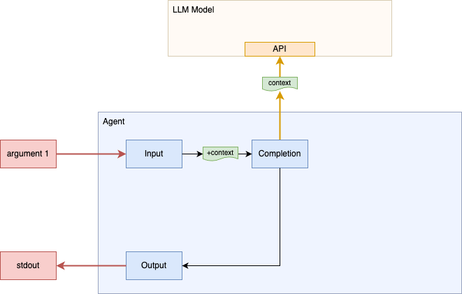
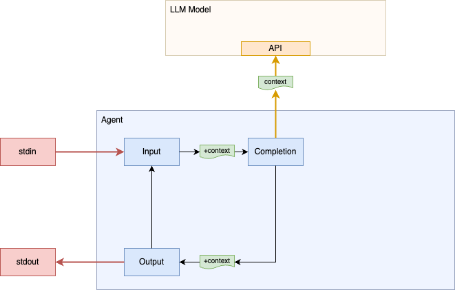
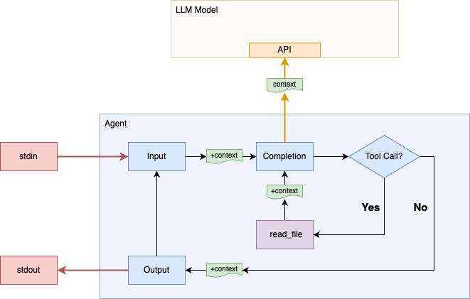
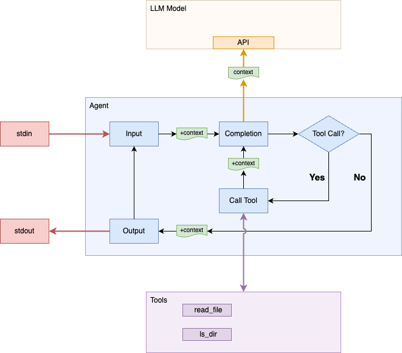
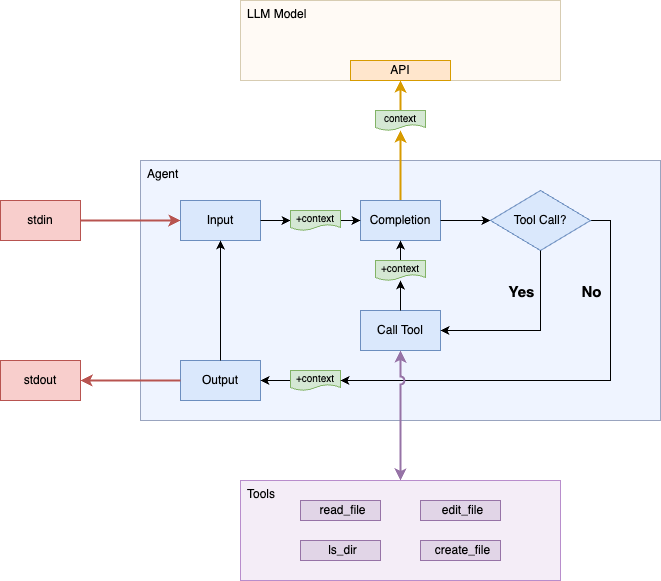

In this post I will show you how to create a working LLM coding agent in 6 incremental steps. We will use the python LiteLLM library and use Github Copilot which means all you need is a github account (in other words, no LLM API sign-up is needed to get started). The full code for each step shown below can be found at <a href="https://github.com/kanaka/litellm-agent">github.com/kanaka/litellm-agent</a>.

# Step 0: Prerequisites (uv, LiteLLM, etc)

You will either need a Github account (to access Github Copilot) or you will need LLM API keys with some billing credits. I recommend starting with the Github Copilot.

* Create a directory for your agent:

```text
<em>$ mkdir my-agent</em>
<em>$ cd my-agent</em>
```

* Install `uv` (if you have not already) and then setup a virtual
  environment:
```text
<em>$ curl -LsSf https://astral.sh/uv/install.sh | sh</em>
<em>$ uv venv</em>
<em>$ source .venv/bin/activate</em>
```

* Clone a branch of the LiteLLM project that has support for Github
  Copilot models. Then install the local copy of LiteLLM and its
  dependencies into the virtual environment:

```text
<em>$ git clone https://github.com/BerriAI/litellm -b litellm_dev_03_05_2025_contributor_prs</em>
<em>$ uv pip install litellm/</em>
```

Note: in the examples that follow, user input that is typed into the agent is shown with a <span style="color: plum">plum</span> color.

We are now ready to start the fun!

# Step 1: Single API call



First, we are going to make a single API "completion" call to our
chosen LLM model and simply print the result. For this step, we will
pass the first argument on the command line as the query that we want
to send the LLM model.

```python
#!/usr/bin/env python3

from litellm import completion
import sys

model = "github_copilot/o3-mini"
extra_headers = {"editor-version": "vscode/1.85.1"}

response = completion(
    model=model,
    extra_headers=extra_headers,
    messages=[{"content": sys.argv[1], "role":"user"}],
)

print(response.choices[0].message.content)
```

Now run your new "agent":

```text
<em>$ chmod +x agent.py</em>

<em>$ ./agent.py "In a single sentence, define the word 'agent'"</em>
An agent is someone or something that acts on behalf of another person or entity, or that produces a specific effect.
```

We make a single call LLM model and provide it with a single "user"
message. We then extract the response message from the LLM and print
it. The LiteLLM `completion` function is based on OpenAPI defined API.
While other providers have similar APIs, they do have differences.
LiteLLM provides a common API that has the same input and output
format across all the providers.

Notes:
* The first time you run your agent with a Github Copilot model, you
  will be shown an 8 character code that you need to fill in at the
  provided github URL in order to authorize this client. Once you do
  this, API access token refreshes will happen automatically.
* With the Github Copilot free plan, you get 50 "<a href="https://docs.github.com/en/copilot/managing-copilot/monitoring-usage-and-entitlements/about-premium-requests">premium requests</a>" per
  month. The code above uses "`github_copilot/o3-mini`" because it is
  currently the least expensive model with excellent coding ability
  (at 0.33 premium requests per call). The
  "`github_copilot/gemini-2.0-flash-001`" model is slightly cheaper
  (at 0.25 per call) but my experience is that it has trouble using
  tools correctly. If you have paid plan then you can switch the model
  to `github_copilot/gpt-4` to get unlimited `completion` calls.
* The "editor-version" HTTP header is needed for now in order to use
  the "Github Copilot" functionality in the LiteLLM branch.

# Step 2: Chat loop



Our current implementation makes a single query, prints the response,
and then exits. We don't have a way to "chat" with the model. LLM
models via the API are essentially stateless. The client program has
to provide all the state/context for each call.

Let's wrap the completion call and output in a loop. Prior to the loop
we initialize a messages list (context) with our initial system
prompt. The loop prompts for a user query, adds this to the context,
calls the `completion` API, and then adds the assistant (LLM model)
response to the messages list in addition to printing it out.

```python
messages = [{"content": "You are a coding agent", "role":"system"}]

while True:
    try:
        user_input = input("user> ")
    except EOFError as e:
        break
    messages.append({"content": user_input, "role":"user"})

    response = completion(
        model=model,
        extra_headers=extra_headers,
        messages=messages,
    )

    resp_message = response.choices[0].message
    messages.append(resp_message.model_dump())
    
    print(f"assistant> {resp_message.content}")
```

Run our new version of the "agent" (user input is shown with a <span
style="color: plum">plum</span> color):

```text
<em>$ ./agent.py</em>
user> <span style="color: plum">List five funny names for a Linux computer (without any explanation):</span>
assistant> TuxTastic
KernelKicker
BashfulBot
PenguinPirate
SudoSultan
user> <span style="color: plum">In a short sentence, explain why the fifth one is funny.</span>
assistant> SudoSultan is funny because it blends the superuser command "sudo" with a regal title, humorously elevating its authority.
```

The second user query asks about the assistant's first response.
A correct answer confirms that the context (messages list) is being
accumulated correctly, otherwise the assistant would not be able to
answer the followup.

# Step 3: Tool calling



Our "agent" does not have much agency; it can't do anything unless it
can convince the user to act on it's behalf. If I ask "Show me what's
in file ./README.md.", the assistant will likely answer that it can't
do that, but will give suggestions to the user for how to view the
file themselves.

Let's take a step towards greater agency by defining a tool that the
assistant can invoke. First, create an API data structure
that defines tools in a format the assistant understands. The
following defines a single tool `read_file` that the assistant can
invoke:

```python
import json
tools = [
    {
        "type": "function",
        "function": {
            "name": "read_file",
            "description": "Read the file at path. Returns a map {'content':content}",
            "parameters": {
                "type": "object",
                "properties": {
                    "path": {"type": "string"},
                },
                "required": ["path"]
            },
        },
    }
]
```

We pass this new tools structure in the `completion` call:

```python
    response = completion(
        model=model,
        extra_headers=extra_headers,
        messages=messages,
        tools=tools,
    )
```

If the assistant decides that it wants to call a tool, then the
response message will contain a populated `tool_calls` field. If this
field is set then we need to parse each element to extract the
function name and arguments, perform the actions, and add a tool call
response with the results to the context (messages list).

First lets add a `trunc` function for abbreviating long tool call
arguments and output:

```python
def trunc(s, max=80):
    return s[:max-4] + '...' if len(s) >= max else s
```

Then, replace the assistant output message line with the following:

```python
    tool_calls = resp_message.tool_calls
    if not tool_calls:
        print(f"assistant> {resp_message.content}")
        continue

    for tc in tool_calls:
        fn = tc['function']
        if fn.name == "read_file":
            fn_args = json.loads(fn.arguments)
            print(trunc(f"calling read_file({fn_args})"))
            fn_result = {"content": open(fn_args['path']).read()}
            res_str = json.dumps(fn_result)
            print(trunc(f"result: {res_str}"))
            messages.append({
                "role": "tool",
                "tool_call_id": tc['id'],
                "name": fn.name,
                "content": res_str,
            })
        else:
            raise Exception(f"Unknown tool call: {fn.name}")
```

There is one additional change that we need to make to the top of our
loop. If the last message from the assistant is a tool call, then we
should skip the user input/prompt and just send the tool call result
that we added:

```python
    if messages[-1]["role"] != "tool":
        try:
            user_input = input("user> ")
        except EOFError as e:
            break
        messages.append({"content": user_input, "role":"user"})
```

Run our new version of the "agent":

```text
<em>$ ./agent.py</em>
user> <span style="color: plum">What is the first line of file ./agent.py?</span>
calling read_file({'path': './agent.py'})
result: {"content": "#!/usr/bin/env python3\n\nfrom litellm import completio...
assistant> The first line of the file is: #!/usr/bin/env python3
```

# Step 4: Generic tools interface



The current implementation uses a hard-coded definition for the
`read_file` tool that is passed to the `completion` API. Instead of
creating a new definition for each tool that we want to support, we
can use python's introspection to generate this definition from the
python functions themselves.

Define a function that that takes a map of tools names to functions
and returns the tools parameter value needed for the `completion` API:

```python
import inspect

def get_tools_param(tools_map):
    typemap = {int: "integer", float: "number", bool: "boolean"}
    tools = []
    for name, fn in tools_map.items():
        props, req = {}, []
        for p in inspect.signature(fn).parameters.values():
            if p.kind.name.startswith("VAR"):  # skip *args/**kw
                continue
            props[p.name] = {"type": typemap.get(p.annotation, "string")}
            if p.default is p.empty:
                req.append(p.name)
        tools.append({
            "type": "function",
            "function": {
                "name": name,
                "description": (fn.__doc__ or "").strip(),
                "parameters": {
                    "type": "object",
                    "properties": props,
                    **({"required": req} if req else {})
                }
            }
        })
    return tools
```

Then define the tool functions with a sufficient docstring and result
format that makes it clear to the assistant how the tools should be
used:

```python
def read_file(path):
    """Read the file at path.
    Returns a map {'content':content} (raw file string in content)"""
    return {"content": open(path).read()}

import subprocess

def ls_dir(path):
    """Runs `ls -la path` to list files in the current directory.
    Returns a map {'stdout':stdout,'stderr':stderr,'returncode':code}"""
    cp = subprocess.run(["ls", "-la", path], capture_output=True, text=True)
    res = {k: getattr(cp, k) for k in ('stdout', 'stderr', 'returncode')}
    return res
```

Remove the global `tools` variable and add a new tools map (after the
tool functions) that enumerates the available tools including the new
`ls_dir` tool/function.

```python
TOOLS_MAP = {
    "read_file": read_file,
    "ls_dir": ls_dir,
}
```

Prior to out main loop use the `get_tools_param` function to
initialize the `tools` value that is passed to the `completion` call:

```python
tools = get_tools_param(TOOLS_MAP)
```

Finally, adjust the tool calling loop to use a more generic mechanism
for calling the tools defined in the `TOOLS_MAP`:

```python
    for tc in tool_calls:
        fn = tc['function']
        if fn.name in TOOLS_MAP:
            fn_args = json.loads(fn.arguments)
            print(trunc(f"calling {fn.name}({fn_args})"))
            fn_result = TOOLS_MAP[fn.name](**fn_args)
            ...
```

Let's try it out:

```text
<em>$ ./agent.py</em>
user> <span style="color: plum">Summarize the functionality of the python file in this dir in one sentence.</span>
calling ls_dir({'path': '.'})
result: {"stdout": "total 16\ndrwxrwxr-x@  7 joelmartin  staff   224 May  2 ...
calling read_file({'path': './agent.py'})
result: {"content": "#!/usr/bin/env python3\n\nfrom litellm import completio...
assistant> This Python script implements an interactive command-line coding agent that leverages a language model to process user inputs and execute defined filesystem tools (such as reading files and listing directory contents) based on dynamically generated tool calls.
```

# Step 5: File editing tools



Our agent has the ability to list and read files, now let's make the
final improvement that will actually turn this into a coding agent.

Define the functions that will allow the agent to edit and
create new files and add them to the `TOOLS_MAP`:

```python
def edit_file(path, match, replace):
    """Edit the file at 'path' replacing the first occurence of
    'match' string with 'replace' string. 'match' and 'replace' are
    raw strings and should not have escaped newlines, backslashes, etc.
    Returns an empty map on success"""
    orig = open(path).read()
    new = orig.replace(match, replace, 1)
    if new == orig: raise Exception("match string not found")
    open(path, "w").write(new)
    return {}

def create_file(path, content):
    """Create (or replace) file at 'path' with 'content'.
    'content' is a raw string and does not need extra escaping.
    Returns an empty map on success"""
    open(path, "w").write(content)
    return {}

TOOLS_MAP = {
    "read_file": read_file,
    "ls_dir": ls_dir,
    "edit_file": edit_file,
    "create_file": create_file,
}
```

Those new tools enable a large amount of agentic coding ability. Let's
improve the error handling and format of the tool calling messages:

```python
            print(trunc(f"tool call> {fn.name}({fn_args})"))
            try:
                fn_result = TOOLS_MAP[fn.name](**fn_args)
            except Exception as e:
                fn_result = {"error": str(e)}
            res_str = json.dumps(fn_result)
            print(trunc(f"tool result> {res_str}"))
            message.append({
                ...
```

Now let's use the new editing ability to make changes to a file:

```text
<em>$ echo 'hello NAME!' > greet.txt</em>

<em>$ ./agent.py</em>
user> <span style="color: plum">Change the greeting in the text file to use my first name.</span>
assistant> Could you please clarify two things for me?
1. What is the path or name of the text file you're referring to?
2. What is your first name that you would like to use in the greeting?
user> <span style="color: plum">My name is Joel. You find the file.</span>
tool call> ls_dir({'path': '.'})
tool result> {"stdout": "total 16\ndrwxrwxr-x@  7 joelmartin  staff   224 Ma...
tool call> read_file({'path': 'greet.txt'})
tool result> {"content": "hello NAME!\n"}
tool call> edit_file({'match': 'NAME', 'replace': 'Joel', 'path': 'greet.txt'})
tool result> {}
assistant> The greeting in greet.txt has been updated to "hello Joel!"
```

Note that sometimes the model will not ask the clarifying questions
and will use the result of `ls_dir` to guess the first name based on
directory/file ownership.

# Step 6: Final touch ups

Those four simple tools/abilities (list files, read a file, create a file, and
edit a file) are enough to give our agent the ability to do coding
tasks. So let's use our agent itself to make some final improvements
to its own code.

```text
<em>$ ./agent.py</em>
user> <span style="color: plum">Copy agent.py to agent2.py where we will make changes. Start by adding a friendly startup message (with model).</span>
tool call> read_file({'path': 'agent.py'})
tool result> {"content": "#!/usr/bin/env python3\n\nfrom litellm import comp...
tool call> create_file({'content': '#!/usr/bin/env python3\n\nfrom litellm i...
tool result> {}
assistant> I've created agent2.py with a friendly startup message that prints the model being used.
user> <span style="color: plum">For the three prints and the input call, colorize the part before the '>' using ASCII escape codes (red, green, blue, purple).</span>
tool call> create_file({'content': '#!/usr/bin/env python3\n\nfrom litellm i...
tool result> {}
assistant> I've updated agent2.py to colorize the prompt and prints. Red is now used for the user input, green for tool call, blue for tool result, and purple for assistant's plain output.
user> <span style="color: plum">Before calling a tool, confirm with the user. If confirmed continue as before, otherwise add a response map to the messages with a "User Refused" error.</span>
tool call> create_file({'content': '#!/usr/bin/env python3\n\nfrom litellm i...
tool result> {}
assistant> I've updated agent2.py to prompt the user for confirmation before calling any tool. If you enter anything other than 'y', the tool call will be skipped and an error message ("User Refused") will be added to the messages.
```

Now test the agent driven code changes:

```text
<em>$ chmod +x agent2.py</em>

<em>$ ./agent2.py</em>
Welcome! Starting agent with model: github_copilot/o3-mini
<span style="color: red">user</span>> <span style="color: plum">What is in ./greet.txt?</span>
<span style="color: yellow">Confirm calling tool 'read_file' with arguments {'path': './greet.txt'}? (y/N)</span>> y
<span style="color: green">tool call</span>> read_file({'path': './greet.txt'})
<span style="color: blue">tool result</span>> {"content": "hello Joel!\n"}
<span style="color: purple">assistant</span>> The content of "./greet.txt" is:
hello Joel!
```

The full code for each of the above steps can be found at <a href="https://github.com/kanaka/litellm-agent">github.com/kanaka/litellm-agent</a>.

# Step 7: You take it from here!

You now have a basic working coding agent. The next steps are up to
you. Here are some ideas:

* Add streaming output so that you can see the progress of the model
  as it is generating longer responses.
* Make the tool confirmation more sophisticated and allow specific
  actions or whole tools to be run without confirmation the next time.
* Add proper python argument parsing. Allow the model name, system
  prompt, tool confirmation mode, etc to be specified as command
  line. Allow the initial query to optionally be specified on the
  command line (like step 1).
* Add the ability to continue a previous session (save/pickle the
  context and reload it if requested).
* Give it the ability to run tests.
* Get it working reliably with other models. For example,
  `github_copilot/gemini-2.0-flash-001` is the cheapest model but it
  has trouble using the tools the way they are currently defined.
