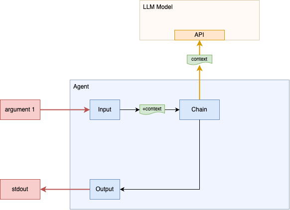
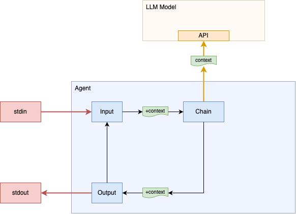
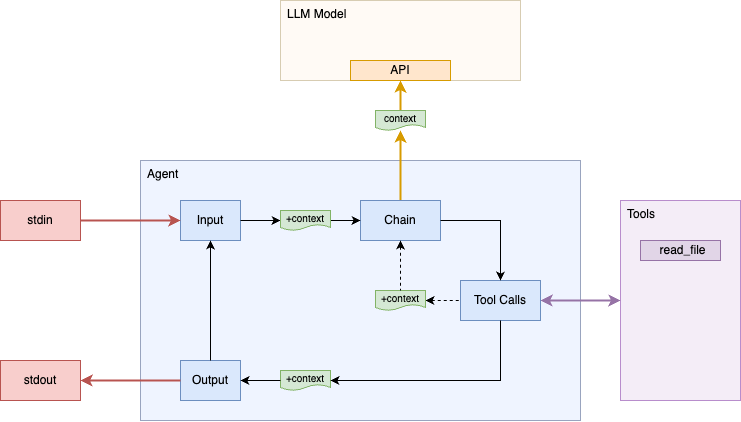
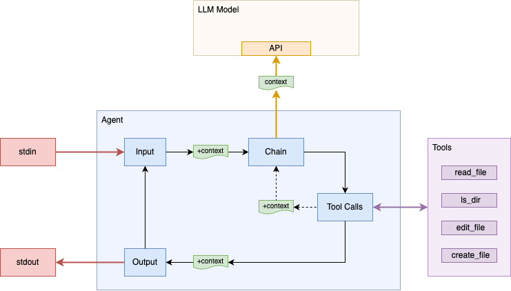

**[Updated 2025-06-16: add Github Copilot authentication command to prerequisites]**

In this post I will show you how to create a working LLM coding agent in 5 incremental steps. We will use Simon Willison's [llm](https://github.com/simonw/llm) library and John Daly's [llm-github-copilot](https://github.com/jmdaly/llm-github-copilot) plugin. The plugin gives us access to LLM models via Github Copilot which means all you need to get started is a github account (no LLM API sign-up/credit card required).

This is very similar to a previous previous post <a href="/blog/litellm-agent-in-six-steps/">An LLM Coding Agent in 6 incremental steps and about 140 lines of python</a>. The key difference is the use of [llm](https://github.com/simonw/llm) instead of LiteLLM. The resulting agent is much more concise and hopefully easier to understand.

# Step 0: Prerequisites (uv, llm, etc)

You will either need a Github account (to access Github Copilot) or you will need LLM API keys with some billing credits. I recommend starting with the Github Copilot.

* Create a directory for your agent:

```text
<em>$ mkdir my-agent</em>
<em>$ cd my-agent</em>
```

* Install `uv` (if you have not already) and then setup a python
  virtual environment:
```text
<em>$ curl -LsSf https://astral.sh/uv/install.sh | sh</em>
<em>$ uv venv</em>
<em>$ source .venv/bin/activate</em>
```

* Install versions of [llm](https://github.com/simonw/llm) and the
  [llm-github-copilot](https://github.com/jmdaly/llm-github-copilot)
  plugin that have sufficient tool calling support.

```text
<em>$ uv pip install "git+https://github.com/simonw/llm.git"</em>
<em>$ uv pip install "git+https://github.com/jmdaly/llm-github-copilot.git@refs/pull/18/head#egg=llm_github_copilot"</em>
```

* Authenticate with Github Copilot. You will be shown an 8 character
  code that you need to fill in at the provided github URL in order to
  authorize this client. Once you do this, API access token refreshes
  will happen automatically.

```text
<em>$ llm github_copilot auth login</em>
```

We are now ready to start the fun!

Notes:
* The full code for each of the steps can be found at <a href="https://github.com/kanaka/llm-agent">github.com/kanaka/llm-agent</a>.
* In the examples that follow, user input that is typed into the agent is shown with a <span style="color: plum">plum</span> color.

# Step 1: Single API call



First, we are going to make a single API prompt call to our
chosen LLM model and simply print the result. For this step, we will
pass the first argument on the command line as the prompt that we want
to send the LLM model.

```python
#!/usr/bin/env python3

import llm
import sys
DEFAULT_MODEL = "github_copilot/o3-mini"

model = llm.get_model(DEFAULT_MODEL)
response = model.prompt(sys.argv[1])
print(response.text())
```

Now run your new "agent":

```text
<em>$ chmod +x agent.py</em>

<em>$ ./agent.py "In a single sentence, define the word 'agent'"</em>
An agent is someone or something that acts on behalf of another person or entity, or that produces a specific effect.
```

We make a single call LLM model and provide it with a single "user"
message. We then print the response message from the LLM.

Notes:
* With the Github Copilot free plan, you get 50 "<a href="https://docs.github.com/en/copilot/managing-copilot/monitoring-usage-and-entitlements/about-premium-requests">premium requests</a>" per
  month. The code above uses "`github_copilot/o3-mini`" because it is
  currently the least expensive model with excellent coding ability
  (at 0.33 premium requests per call). The
  "`github_copilot/gemini-2.0-flash-001`" model is slightly cheaper
  (at 0.25 per call) but does not have full tool calling support via
  Github Copilot.  If you have paid plan then you can switch the model
  to `github_copilot/gpt-4.1` to get unlimited `completion` calls.
* Refer to [llm prompt API documentation](https://llm.datasette.io/en/latest/python-api.html#basic-prompt-execution)


# Step 2: Chat loop



Our current implementation makes a single query, prints the response,
and then exits. We don't have a way to "chat" with the model. LLM
models via their direct APIs are essentially stateless. The client
has to provide all the state/context for each call. The llm library
provides a conversation object that will accumlate this state for us.

Let's construct a conversation instance and then wrap its prompt calls
in a loop. The loop prompts for a user prompt, calls the
`conversation.prompt` API with the user prompt, and then prints the
response.

```python
#!/usr/bin/env python3

import llm
DEFAULT_MODEL = "github_copilot/o3-mini"

# Conversation setup

model = llm.get_model(DEFAULT_MODEL)
conversation = model.conversation()

while True:
    try:
        user_input = input("user> ")
    except EOFError as e:
        break

    response = conversation.prompt(user_input)
    print(f"assistant> {response.text()}")
```

Run our new version of the "agent" (user input is shown with a <span
style="color: plum">plum</span> color):

```text
<em>$ ./agent.py</em>
user> <span style="color: plum">List five funny names for a Linux computer (without any explanation):</span>
assistant> TuxTastic
KernelKicker
BashfulBot
PenguinPirate
SudoSultan
user> <span style="color: plum">In a short sentence, explain why the fifth one is funny.</span>
assistant> SudoSultan is funny because it blends the superuser command "sudo" with a regal title, humorously elevating its authority.
```

The second user query asks about the assistant's first response.
A correct answer confirms that the context (previous user and
assistant messages) is being accumulated correctly, otherwise the
assistant would be unable to answer the followup question.

# Step 3: Tool calling



Our "agent" does not have much agency; it can't do anything unless it
can convince the user to act on it's behalf. If I ask "Show me what's
in file ./README.md.", the assistant will likely answer that it can't
do that, but will give suggestions to the user for how to view the
file themselves.

Let's take a step towards greater agency by defining a tool that the
assistant can invoke. Define a function `read_file` that the
assistant can invoke and add it to a tools list:

```python
# Tool definitions

def read_file(path: str):
    "Read the file at path. Returns a map {'content':content}"
    return {"content": open(path).read()}

tools = [read_file]
```

Let's also define some debug functions for concisely showing tool
calls and responses and then pass the tools

```python
def trunc(s, max=80):
    return s[:max-4] + '...' if len(s) >= max else s

def before_call(tool, tool_call):
    print(trunc(f"tool call> {tool.name}({tool_call.arguments})"))

def after_call(tool, tool_call, tool_result):
    print(trunc(f"tool result> {tool_result.output}"))

```

We need to include the tools list and debug functions when we
instantiate our conversation instance:

```python
model = llm.get_model(DEFAULT_MODEL)
conversation = model.conversation(
    tools=tools,
    before_call=before_call,
    after_call=after_call,
)
```

Finally, in our loop, we use the `conversation.chain` method instead
of the `prompt` method.

```python
    response = conversation.chain(user_input)
```

The `chain` method will will automatically
detect when the assistant returns a response containing a tool call.
It will then run that tool and send the result of the tool to the
assistant. All tool calls are resolved before the `chain` method
returns with the final assistant response.

Run our new version of the "agent":

```text
<em>$ ./agent.py</em>
user> <span style="color: plum">List the imports in ./agent.py</span>
tool call> read_file({'path': './agent.py'})
tool result> {"content": "#!/usr/bin/env python3\n\nimport llm\nDEFAULT_MODE...
assistant> The file contains a single import:

import llm
```

Notes:
* Refer to [llm conversation API documentation](https://llm.datasette.io/en/latest/python-api.html#conversations)

# Step 4: File editing tools



Our agent has the ability to read files, now let's make the final
small change that will turn it into a true coding agent. All that is
need is a few more functions that give it the ability to list files,
edit files, and create files.

```python
import subprocess

def ls_dir(path):
    """Runs `ls -la path` to list files in the current directory.
    Returns a map {'stdout':stdout,'stderr':stderr,'returncode':code}"""
    cp = subprocess.run(["ls", "-la", path], capture_output=True, text=True)
    res = {k: getattr(cp, k) for k in ('stdout', 'stderr', 'returncode')}
    return res

def edit_file(path, match, replace):
    """Edit the file at 'path' replacing the first occurence of
    'match' string with 'replace' string. 'match' and 'replace' are
    raw strings and should not have escaped newlines, backslashes, etc.
    Returns an empty map on success"""
    orig = open(path).read()
    new = orig.replace(match, replace, 1)
    if new == orig: raise Exception("match string not found")
    open(path, "w").write(new)
    return {}

def create_file(path, content):
    """Create (or replace) file at 'path' with 'content'.
    'content' is a raw string and does not need extra escaping.
    Returns an empty map on success"""
    open(path, "w").write(content)
    return {}

tools = [read_file, ls_dir, edit_file, create_file]
```

Now let's use the new editing ability to make changes to a file:

```text
<em>$ echo 'hello NAME!' > greet.txt</em>

<em>$ ./agent.py</em>
user> <span style="color: plum">Change the greeting in the text file to use my first name.</span>
assistant> I need a bit more information before proceeding. Could you please tell me the file name (or path) of the text file you want to change, and also provide your first name that should be used in the greeting?
user> <span style="color: plum">My name is Joel. You find the file.</span>
tool call> ls_dir({'path': '.'})
tool result> {"stdout": "total 20\ndrwxrwxr-x  3 joelmartin joelmartin 4096 ...
tool call> read_file({'path': 'greet.txt'})
tool result> {"content": "hello NAME!\n"}
tool call> edit_file({'match': 'NAME', 'path': 'greet.txt', 'replace': 'Joel'})
tool result> {}
assistant> I've updated greet.txt so that the greeting now reads "hello Joel!" Let me know if you need any further changes.
```

Note that sometimes the model will not ask the clarifying questions
and will use the result of `ls_dir` to guess the first name based on
directory/file ownership.

# Step 5: Final changes (and a sprinkle of inception)

Those four simple tools/abilities (list files, read a file, edit
a file, and create a file) are enough to give our agent the ability to
do coding tasks. So let's use our agent itself to make some final
improvements to its own code.

```text
<em>$ ./agent.py</em>
user> <span style="color: plum">Copy agent.py to agent2.py where we will make changes. Use correct python indenting for all future changes.</span>
tool call> read_file({'path': 'agent.py'})
tool result> {"content": "#!/usr/bin/env python3\n\nimport llm\nDEFAULT_MODE...
tool call> create_file({'content': '#!/usr/bin/env python3\n\nimport llm\nDE...
tool result> {}
assistant> agent2.py has been created with the same content as agent.py. Let me know what changes you'd like to make next.
user> <span style="color: plum">Add a friendly startup message showing the model.</span>
tool call> edit_file({'match': ')\n\nwhile True:', 'path': 'agent2.py', 'rep...
tool result> {}
assistant> I've inserted a friendly startup message that displays the model in agent2.py. Let me know if you need any other modifications.
user> <span style="color: plum">For the three prints and the input call, colorize the part before the '>' using ASCII escape codes (red, green, blue, purple).</span>
tool call> edit_file({'match': 'input("user> "', 'path': 'agent2.py', 'repla...
tool result> {}
tool call> edit_file({'match': 'tool call>', 'path': 'agent2.py', 'replace':...
tool result> {}
tool call> edit_file({'match': 'tool result>', 'path': 'agent2.py', 'replace...
tool result> {}
tool call> edit_file({'match': 'assistant>', 'path': 'agent2.py', 'replace':...
tool result> {}
assistant> I've updated agent2.py to colorize the parts before the '>' using the specified ASCII escape codes:
- The input prompt now colors "user" in red,
- The "tool call>" prefix is colored in green,
- The "tool result>" prefix is colored in blue,
- The "assistant>" prefix is colored in purple.

Let me know if there are any further changes you'd like to apply!
user> <span style="color: plum">Before calling a tool, confirm with the user. If confirmed continue as before, otherwise raise a llm.CancelToolCall exception with a "User Refused" message.</span>
tool call> edit_file({'match': 'print(trunc(f"\\033[32mtool call\\033[0m> {t...
tool result> {}
assistant> I've updated the agent2.py before_call function to confirm with the user before calling a tool. The tool call will now prompt the user with "Proceed with tool call? (y/n)" and raise a llm.CancelToolCall exception if the user does not confirm.

Let me know if additional modifications are needed!
```

Now review the code changes and then test our agent modified agent:

```text
<em>$ diff -urp agent.py agent2.py</em>
...

<em>$ chmod +x agent2.py</em>

<em>$ ./agent2.py</em>
Agent started with model: github_copilot/o3-mini
<span style="color: red">user</span>> <span style="color: plum">What is in ./greet.txt?</span>
<span style="color: green">tool call</span>> read_file({'path': './greet.txt'})
Proceed with tool call? (y/n) <span style="color: plum">y</span>
<span style="color: blue">tool result</span>> {"content": "hello Joel!\n"}
<span style="color: purple">assistant</span>> The file contains: "hello Joel!" followed by a newline.
```

Notes:
* The full code for each of the steps can be found at <a href="https://github.com/kanaka/llm-agent">github.com/kanaka/llm-agent</a>.

# Step 6: You take it from here!

You now have a basic working coding agent. The next steps are up to
you. Here are some ideas:

* Add streaming output so that you can see the progress of the model
  as it is generating longer responses.
* Make the tool confirmation more sophisticated and allow specific
  actions or whole tools to be run without confirmation the next time.
* Add proper python argument parsing. Allow the model name, system
  prompt, tool confirmation mode, etc to be specified as command
  line. Allow the initial query to optionally be specified on the
  command line (like step 1).
* Give it the ability to run tests.
